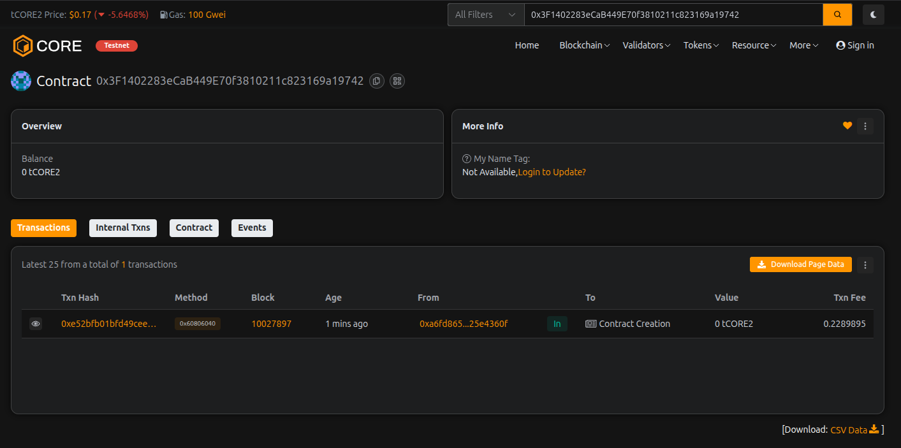

# DexiFi Bridge

## Project Description

DexiFi Bridge is a decentralized cross-chain bridge protocol designed to facilitate seamless token transfers between different blockchain networks. The smart contract provides a secure, efficient, and transparent mechanism for users to bridge their assets across multiple chains while maintaining custody and security through a relayer-based system.

The protocol implements a fee-based model where users can initiate bridge transactions, which are then validated and completed by authorized relayers. The contract ensures safety through multiple security features including pausability, access control, and transaction status tracking.

## Project Vision

Our vision is to create a unified DeFi ecosystem where assets can flow freely across different blockchain networks without barriers. DexiFi Bridge aims to:

- **Eliminate Fragmentation**: Break down the silos between different blockchain networks
- **Enhance Liquidity**: Enable users to access liquidity pools and DeFi protocols across multiple chains
- **Ensure Security**: Provide a trustless and secure bridging mechanism with minimal risk
- **Promote Interoperability**: Foster a truly interconnected blockchain ecosystem
- **Democratize Access**: Make cross-chain transactions accessible to all users regardless of technical expertise

## Key Features

### 1. **Multi-Chain Support**
- Support for multiple blockchain networks
- Easy addition and removal of supported chains by administrators
- Dynamic chain configuration

### 2. **Secure Transaction Processing**
- Transaction status tracking (Pending, Completed, Cancelled, Failed)
- Unique transaction IDs using cryptographic hashing
- Locked balance mechanism to prevent double-spending

### 3. **Relayer System**
- Authorized relayer network for transaction validation
- Multi-relayer support for decentralization
- Admin controls for relayer management

### 4. **Fee Management**
- Configurable bridge fees (in basis points)
- Maximum fee cap (10%) to protect users
- Transparent fee calculation

### 5. **Emergency Controls**
- Pausable functionality for emergency situations
- Admin-only critical functions
- Transaction cancellation capability

### 6. **User-Friendly Interface**
- Simple initiation of bridge transfers
- Real-time transaction status queries
- Balance tracking for locked tokens

### 7. **Event Logging**
- Comprehensive event emissions for all major actions
- Easy integration with front-end applications
- Transaction history tracking

### 8. **Access Control**
- Owner-based administrative functions
- Relayer authorization system
- Secure modifier implementation

### 9. **Transparency**
- Public transaction records
- Viewable locked balances
- Open chain support verification

### 10. **Scalability**
- Efficient data structures
- Optimized gas usage
- Support for unlimited transactions

## Future Scope

### Short-term Enhancements (3-6 months)
- **Token Wrapping**: Implement automatic token wrapping/unwrapping for native assets
- **Multi-Signature Support**: Add multi-sig wallet integration for enhanced security
- **Fee Distribution**: Implement fee distribution mechanism for relayers
- **Transaction Batching**: Enable batch processing of multiple bridge transactions

### Medium-term Development (6-12 months)
- **Liquidity Pools**: Integrate liquidity pools for instant bridging
- **NFT Bridging**: Extend functionality to support NFT transfers
- **Oracle Integration**: Add price oracles for accurate fee calculation
- **Automated Relayers**: Develop automated relayer nodes for faster processing
- **Mobile SDK**: Create mobile SDKs for iOS and Android platforms

### Long-term Goals (1-2 years)
- **Zero-Knowledge Proofs**: Implement ZK-proofs for enhanced privacy
- **Cross-Chain Messaging**: Enable arbitrary data transfer between chains
- **Governance Token**: Launch governance token for decentralized protocol management
- **Insurance Pool**: Create an insurance mechanism for failed transactions
- **Layer 2 Integration**: Support for Layer 2 solutions (Optimism, Arbitrum, zkSync)
- **Decentralized Relayer Network**: Transition to fully decentralized relayer system with staking

### Advanced Features
- **AI-Powered Route Optimization**: Use AI to find optimal bridging routes
- **Cross-Chain DeFi Aggregator**: Integrate with DEXs across multiple chains
- **Regulatory Compliance Tools**: Add KYC/AML modules for institutional adoption
- **Interoperability Standards**: Align with emerging cross-chain standards (IBC, XCMP)

## Deployment Guide

### Constructor Parameters

**IMPORTANT:** The DexiFiBridge contract now has **NO constructor parameters required**!

The contract automatically sets:
- **Default Bridge Fee**: 0.5% (50 basis points)
- **Owner**: Deployer address
- **Initial Relayer**: Deployer address

### Deployment Steps

1. Open Remix IDE or your preferred deployment tool
2. Compile the contract with:
   - Compiler: **0.8.24**
   - EVM Version: **Cancun**
   - Optimization: **Enabled (200 runs)**
3. **Deploy** - No constructor arguments needed! ✅
4. After deployment, configure the bridge

### Post-Deployment Configuration

After deploying, configure the bridge:

```solidity
// Add supported chains
addSupportedChain(1);      // Ethereum Mainnet
addSupportedChain(137);    // Polygon
addSupportedChain(56);     // BSC
addSupportedChain(42161);  // Arbitrum

// Update fee if needed (optional)
updateBridgeFee(100);      // Change to 1% fee

// Add relayers (if needed)
addRelayer(0xYourRelayerAddress);
```

### Contract Improvements

✅ **No constructor parameters** - Deploy instantly without arguments  
✅ **ERC20 token support** - Actual token transfers implemented  
✅ **Native ETH support** - Bridge ETH and ERC20 tokens  
✅ **Receive/Fallback functions** - Accept ETH transfers  
✅ **Ownership transfer** - Transfer contract ownership  
✅ **Enhanced security** - Proper token transfer validation  
✅ **Gas optimized** - Cancun EVM with custom errors  

**Default Configuration:**
- Bridge Fee: 0.5% (50 basis points)
- EVM Version: Cancun
- Solidity: ^0.8.24

## Contract Details:

Transaction id: 0x3F1402283eCaB449E70f3810211c823169a19742
